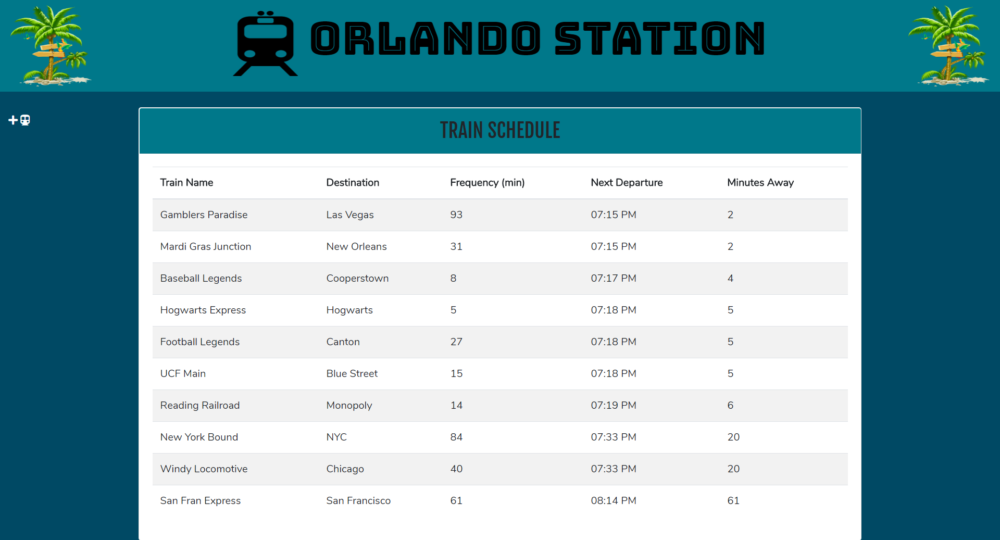

# Train-Scheduler

### This was an assignment for the UCF coding boot camp. It is a train scheduler that utilizes the Google Firebase Database and Moment.js for the updated schedule.

## Screenshot

## Technologies Used
* HTML
* CSS
* JavaScript
* Google Firebase
* Moment.js
* jQuery
* Bootstrap
* Font Awesome
* Google Fonts

## View the Application
https://minneolamike.github.io/Train-Scheduler/